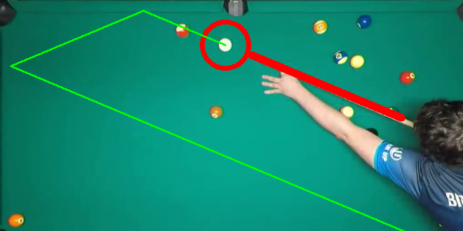

# pool-vision

Use some CV to process videofeed of a pool table, and project the trajectories onto the table.

## Overview
A CV project made to practice using traditional methods (no learning methods). Uses contours, edges, Hough transforms, and cross-correlation to locate and transform all the items in frame.

